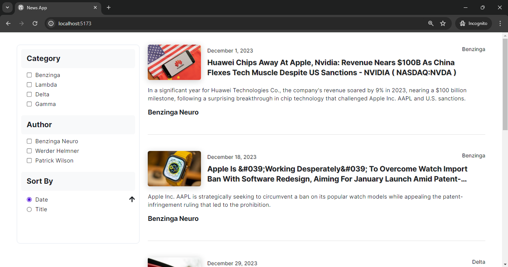

<h1>News Application</h1>

**Live Demo:** [View Application](https://www.google.com)

This **React and TypeScript** application offers advanced **filtering, sorting, and pagination
features**, enabling users to efficiently manage data retrieval. Users can sort articles by date or
title and filter results based on category or author. The application ensures seamless navigation by
**dynamically updating pagination based on filtered outputs**. State management is efficiently
handled using the **Context API**, with **SCSS** for modular UI styling. Comprehensive error
handling mechanisms are integrated to ensure reliability and robustness, enhancing the overall user
experience.

<h2>Table of Contents</h2>

- [Technologies Used](#technologies-used)
- [Installation](#installation)
- [Usage](#usage)
- [Screenshots](#screenshots)
  - [Screenshot 1](#screenshot-1)
  - [Screenshot 2](#screenshot-2)

## Technologies Used

- **React**: A JavaScript library for building user interfaces.
- **React Router DOM**: Manages seamless navigation for the application, including error pages
  like 404.
- **SCSS**: For styling the UI.
- **TypeScript**: A typed superset of JavaScript that compiles to plain JavaScript.
- **Context API**: For state management.
- **Axios**: For data fetching.

## Installation

1. Clone the repository:
   ```bash
   git clone https://github.com/surajbera/react-news-application
   ```
2. Install the dependencies:
   ```bash
   npm install
   ```

## Usage

1. Start the development server:
   ```bash
   npm run dev
   ```
2. Open [http://localhost:5173/](http://localhost:5173/) to view it in the browser.

## Screenshots

### Screenshot 1



### Screenshot 2


